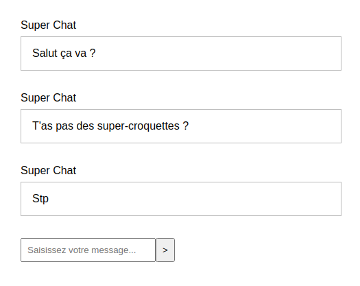
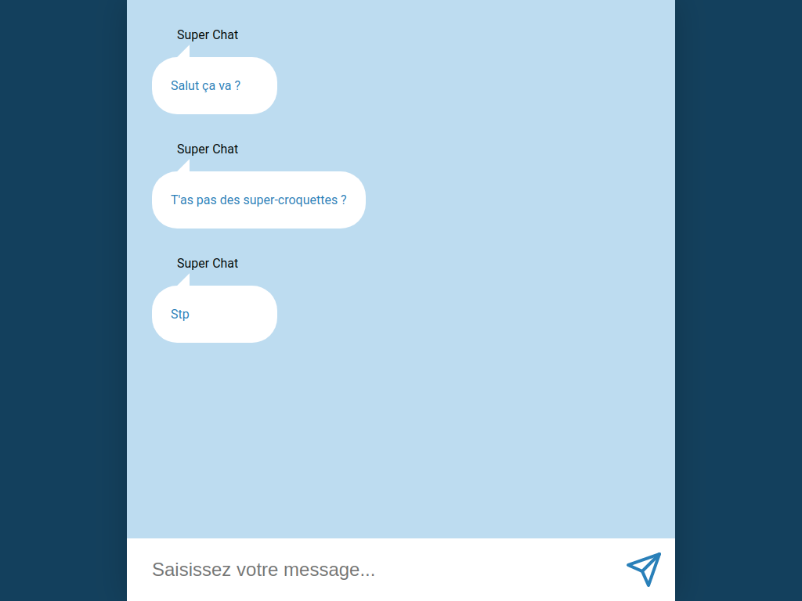

# Chatroom

On va construire un chat entièrement fonctionnel :scream:  
Pas de panique on va y aller étape par étape, ce soir on commence par pouvoir envoyer un message en utilisant Redux.  
On verra demain pour qu'on puisse nous répondre, tant pis si on parle tout seul pendant quelque temps :smile:

## Résultat



## Styles

On part au plus simple pour commencer, on peaufinera ensuite ;)

## Fonctionnalités

On doit pouvoir

- saisir un message dans le champ du bas
- soumettre ce message
- faire apparaître ce message dans la liste au-dessus, avec un nom d'auteur par défaut

Bien sûr **tu dois** utiliser **Redux** et **React Redux** pour gérer tes données et tes actions !

## Énoncé Aventurier

- Tout est dit :arrow_up:

## Énoncé Guidé

<details>
  <summary>
    Quelques pistes
  </summary>

Objectif : construire la ChatRoom

**1 - Config :** récupération des outils et de la config

- on récupère le modèle
- on installe les dépendances

**2 - Render :** instanciation du composant racine et rendu dans le DOM réel

- on vérifie qu'on fait bien le rendu d'un élément React dans le DOM avec le `render` de ReactDom

**3 - Découpage :** dans le composant racine on identifie les zones principales de l'appli

- on peut nommer le composant racine `App` ou `Chat` (ou autre au choix), il contiendra un listing de messages et une zone de formulaire

**4 - Composants :** responsables de la représentation d'un fragment d'interface

- on décrit un composant `Form` pour le formulaire
- on décrit un composant `Messages` pour le listing des messages
- on décrit un composant `Message` pour le contenu d'un message

**5 - Props :** configuration des composants via les props

- le composant `Message` transpose une chaîne de caractère représentant un message vers une représentation
  - on passe une prop à l'instanciation des `Message` dans `Messages`
  - dans le composant on récupère la prop, on la type et on s'en sert

**6 - Store :** détenteur de la vérité

- on installe Redux
- on crée le store, le gardien du state, pour cela aide-toi du code produit en cours dans le dossier `store`

- <details><summary>Solution pour créer le store</summary>

    ```ts
    import { configureStore } from '@reduxjs/toolkit';
    import monReducer from 'chemin/vers/reducer';
    const store = configureStore({
      reducer: {
        chat: monReducer, // Je renseigne mon reducer
      },
    });
    export default store;
    // Je déduis le type `RootState` et `AppDispatch` depuis le store lui même
    export type RootState = ReturnType<typeof store.getState>;
    // Inferred type: {posts: PostsState, comments: CommentsState, users: UsersState}
    export type AppDispatch = typeof store.dispatch;
    ```

    </details>

- **Reducer :** fonction qui sait retourner un nouveau state en fonction d'une action
  - on crée le reducer à fournir au store, pour le moment il ne gère aucune action, pour cela aide-toi du reducer codé en cours
- **State initial :** données représentant l'état initial de notre application
  - il nous faut la liste des messages initiaux dans le state
- <details><summary>Solution pour créer le reducer</summary>

    ```ts
    type ReducerState = {
      /*
        spécifier le type de notre state
      */
    }
    const initialState: ReducerState = {
      /* 
        ranger les messages initiaux dans le state
      */
    };
    const monSlice = createSlice({
      name: 'slice',
      initialState,
      reducers: {}
    });
    export const {} = monSlice.actions;
    export default monSlice.reducer;
    ```

    </details>

**7 - Provider :** diffuseur du store

- notre store est notre interface pour dialoguer avec le state, on le veut partout
- on installe React-Redux
- on instancie le composant `Provider` à la racine de notre application, on passe le composant racine en enfant du provider
- on importe le store pour la passer en prop au provider
- pense toujours à regarder les exemples du jour

**8 - useSelector :** branchement en lecture

- le composant `Messages` veut ses messages qui sont en principe dans le state connu du store, le hook `useSelector` fourni par react-redux va nous permettre d'aller les récupérer et de nous en servir avec un `map` par exemple pour appeler plusieurs fois le composant `Message` à qui on va passer le contenu de chaque message en props
- comme toujours va voir le code du jour pour retrouver comment utiliser `useSelector` ou aide toi de la [documentation](https://react-redux.js.org/api/hooks)
- n'hésite pas à créer les hooks customs pour gérer les types automatiquement ([documentation](https://react-redux.js.org/using-react-redux/usage-with-typescript#define-typed-hooks))

Notre application sait afficher correctement des messages, il faut maintenant pouvoir en ajouter, on prépare un **champ contrôlé** puis on gère la soumission du formulaire

On fait en sorte que la `value` du champ de notre composant `Form` dépende du state

- on définit une valeur initiale dans notre state initial
- on reprend l'étape 8 pour utiliser `useSelector` et afficher une valeur dans notre formulaire qui vient du state

Puis il faut pouvoir modifier la valeur de ce champ, pour cela on passe à l'étape 9

**9 - useDispatch** : émission d'intentions

- **Event :** dans les composants on réagit à des interactions
  - on ajoute un écouteur via une prop `onClick`, `onSubmit`, `onChange`, ... dans le composant
  - <details><summary>Un peu d'aide</summary>

      ```jsx
      // mon composant
      const Composant = () => {
        const handleChange = (event: React.ChangeEvent<HTMLInputElement>) => {
          console.log(event.target.value);
          // Ici j'ai l'intention de changer la valeur du champ
        }
        return (
          <form>
            <input onChange={handleChange} />
          </form>
        );
      };
      ```

      </details>

  - oui mais quoi faire quand l'event a lieu ? on va émettre une intention :arrow_down:
- **Dispatch d'une Action :** émission d'une intention
  - on appelle le hook `useDispatch` fourni par react-redux pour récupérer la fonction `dispatch` capable d'émettre une intention
  - on fait en sorte de dispatcher une action en réponse à une interaction
  - Prépare l'**action** qui va bien
  - Quand l'intention est émise, plus qu'à la traduire dans les faits
- **Reducer** = un traducteur d'intentions
  - Dispatcher, c'est appeler la méthode dispatch du store. On fait donc travailler notre store qui va appeler le reducer et lui passer l'action pour savoir comment le state doit évoluer
  - on ajoute un `case` dans notre reducer pour gérer le cas de cette action et décrire comment devra évoluer le state en fonction de l'action
  - <details><summary>Un exemple ?</summary>

      ```js
        const monSlice = createSlice({
          // ...
          reducers: {
            monActionAvecParams(state, action: PayloadAction<MonSuperTypeTropChouette>) {
              state.yeah = action.payload
            }
          }
        })
      ```

      </details>

On reprend l'étape 9 pour gérer la soumission

</details>

---

## Bonus

<details>
  <summary>
    S'il te reste du jus, un peu de CSS ?
  </summary>

### On peaufine

Rapproche toi de la capture ci-dessous en retravaillant tes styles


